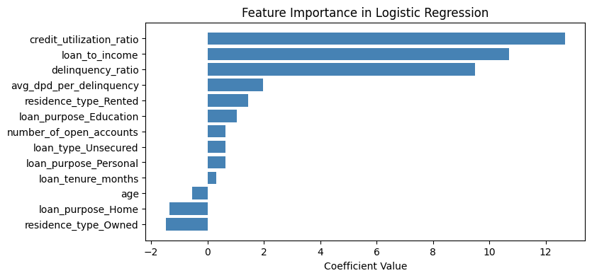

# 📊 Credit Risk Prediction App

An end-to-end **Credit Risk Modelling** app using machine learning, deployed with **Streamlit**.

Predict the likelihood of a borrower defaulting based on financial history, income, loan details, and behavioral metrics. Built as part of a portfolio project to demonstrate data science and model deployment skills.

🔗 **Live App**: [mlprojcreditriskmodel.streamlit.app](https://mlprojcreditriskmodel.streamlit.app/)

---

## ❓ Why does it matter?

Credit risk modelling is a **critical part of financial decision-making**. Accurate predictions can:

- Prevent loan defaults  
- Help lenders make informed decisions  
- Improve access to credit for low-risk borrowers  

This app showcases how **machine learning can automate and enhance** the risk evaluation process in real-time.

## 🧠 Key Features

- ✅ Predicts **Default Probability**, **Credit Score**, and **Risk Rating**
- 🧮 Calculates important metrics like **Loan-to-Income Ratio**
- 🎯 Accepts inputs like income, loan amount, purpose, DPD, open accounts, etc.
- 📊 Interactive UI with sliders, metrics, dropdowns, and real-time risk evaluation
- 🖼️ Animated and responsive interface with **Lottie** integration
- 🚀 Deployed publicly using **Streamlit Cloud**

---

##  How It Works

- Users provide input values such as **age**, **income**, **loan amount**, **credit history**, **loan tenure**, and other financial indicators.
- The **Streamlit UI** captures the inputs and sends them to `prediction_helper.py`.
- Inputs are **preprocessed**, converted into model-ready format, and **scaled** using saved preprocessing logic.
- The trained prediction model (`model_data.joblib`) is used to generate:
  - 📉 **Default Probability**
  - 🏅 **Credit Score**
  - ✅ **Risk Rating** (e.g., Low, Medium, High)
- Based on the result:
  - If **Default Probability > 0.5** → User is flagged as **high risk** (🔴)
  - Else → User is marked **low risk** (🟢)
- The result is instantly displayed in the UI using **dynamic metric cards** and **visual cues**.


---


## 📊 Visual Insights

These visualizations helped drive model development and explainability by revealing data patterns, feature impact, and model performance:

| Visualization | Description |
|---------------|-------------|
|  | KDE plots comparing feature distributions for defaulters vs non-defaulters to identify impactful predictors for credit risk modeling. |
|  | Shows feature relationships and correlation with default status to guide feature engineering and reduce multicollinearity. |
|  | Ranks key features influencing credit risk using logistic regression coefficients, improving model transparency and feature understanding. |
|  | ROC curve illustrating model performance trade-offs and AUC score, helping evaluate predictive power across thresholds. |

---

## 📁 Project Structure

```
├── app/
│   ├── artifacts/
│   │   └── model_data.joblib         # Trained model
│   ├── app.py                        # Streamlit UI (entrypoint)
│   ├── main.py                       # Optional for CLI/local runs
│   └── prediction_helper.py          # Input preprocessing and prediction logic
│
├── artifacts/
│   └── model_data.joblib             # Backup model storage
│
├── dataset/
│   ├── bureau_data.csv
│   ├── customers.csv
│   └── loans.csv                     # Source datasets
│
├── credit_risk_model.ipynb  # Development notebook
├── requirements.txt
├── README.md
├── LICENSE
└── .gitignore
```

---

## 🚀 How to Run Locally

### 1️⃣ Clone the Repository

```bash
git clone https://github.com/yourusername/Credit_risk_model.git
cd credit-risk-app
```

### 2️⃣ Install Dependencies

```bash
pip install -r requirements.txt
```

> ✅ Compatible with **Python 3.10+**. For Python 3.12, use `numpy>=1.26.0`.

### 3️⃣ Run the Streamlit App

```bash
streamlit run app/app.py
```

---

## ⚙️ Tech Stack

- **Python 3.10+**
- **Streamlit** for frontend & deployment
- **scikit-learn** for model training
- **XGBoost** for gradient boosting models
- **pandas**, **numpy** for data handling
- **joblib** for model serialization


---


## 📝 License

This project is licensed under the [MIT License](LICENSE).

---

## 🙌 Acknowledgements

- Built during the [Codebasics ML Course](https://codebasics.io/)


---


<!---

## 🎥 App in Action

> 👉 Replace the GIF below with a real app demo  


---

## 🖼️ Screenshots

| User Input Interface | Prediction Output |
|----------------------|-------------------|
|  |  |

---
-->